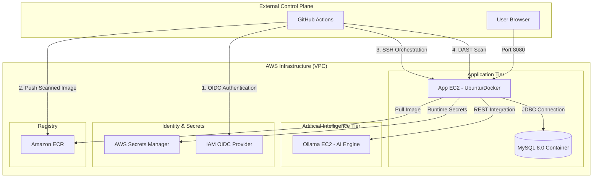

<div align="center">

# DevSecOps Banking Application

A high-performance, containerized financial platform built with Spring Boot 3, Java 21, and integrated Contextual AI. This project implements a secure "DevSecOps Pipeline" using GitHub Actions, OIDC authentication, and AWS managed services.

[](https://www.oracle.com/java/technologies/javase/jdk21-archive-downloads.html)
[](https://spring.io/projects/spring-boot)
[](.github/workflows/devsecops.yml)
[](#phase-3-security-and-identity-configuration)

</div>


---

## Technical Architecture

The application is deployed across a multi-tier, segmented AWS environment. The control plane leverages GitHub Actions with integrated security gates at every stage.



---

## Security Pipeline (DevSecOps Pipeline)

The CI/CD pipeline enforces **9 sequential security gates** before any code reaches production:

| Gate | Name | Tool | Purpose |
| :---: | :--- | :--- | :--- |
| 1 | Secret Scan | Gitleaks | Scans entire Git history for leaked secrets |
| 2 | Lint | Checkstyle | Enforces Java Google-Style coding standards |
| 3 | SAST | Semgrep | Scans Java source code for security flaws and OWASP Top 10 |
| 4 | SCA | OWASP Dependency Check (first time run can take more than 30+ minutes) | Scans Maven dependencies for known CVEs |
| 5 | Build | Maven | Compiles and packages the application |
| 6 | Container Scan | Trivy | Scans the Docker image for OS and library vulnerabilities |
| 7 | Push | Amazon ECR | Pushes the image only after Trivy passes |
| 8 | Deploy | SSH / Docker Compose | Automated deployment to AWS EC2 |
| 9 | DAST | OWASP ZAP | Dynamic attack surface scanning on live app |

---

## Technology Stack

- **Backend Framework**: Java 21, Spring Boot 3.4.1
- **Security Strategy**: Spring Security, IAM OIDC, Secrets Manager
- **Persistence Layer**: MySQL 8.0 (Docker Container)
- **AI Integration**: Ollama (TinyLlama)
- **DevOps Tooling**: Docker, Docker Compose, GitHub Actions, AWS CLI, jq
- **Infrastructure**: Amazon EC2, Amazon ECR, Amazon VPC

---

## Implementation Phases

### Phase 1: AWS Infrastructure Initialization

1. **Container Registry (ECR)**:

   - Establish a private ECR repository named `devsecops-bankapp`.

      


2. **Application Server (EC2)**:

   - Deploy an Ubuntu 22.04 instance with below `User Data`.

      ```bash
      #!/bin/bash

      sudo apt update 
      sudo apt install -y docker.io docker-compose-v2 jq
      sudo usermod -aG docker ubuntu
      sudo newgrp docker
      sudo snap install aws-cli --classic
      ```

   - Configure Security Group to open inbound rule for Port 22 (Management) and Port 8080 (Service).

      > Better to give `name` to Security Group created.

   - Create an IAM Instance Profile(IAM EC2 role) containing permissions:
     - `AmazonEC2ContainerRegistryPowerUser`
     - `AWSSecretsManagerClientReadOnlyAccess`

        


   - Attach it to Application EC2. Select EC2 -> Actions -> Security -> Modify IAM role -> Attach created IAM role.

      

   
   - Connect to EC2 Instance and Run below command to check whether IAM role is working or not.

      ```bash
      aws sts get-caller-identity
      ```

      You will get your account details with IAM role assumed.

3. **AI Engine Tier (Ollama)**:
   - Deploy a dedicated Ubuntu EC2 instance.
   - Open Inbound Port `11434` from the Application EC2 Security Group.

      > Better to give `name` to Security Group created.
        
      


   - Automate initialization using the [ollama-setup.sh](scripts/ollama-setup.sh) script via EC2 User Data.
    
     


   - Verify the AI engine is responsive and the model is pulled in `AI engine EC2`:

     ```bash
     ollama list
     ```

      


---

### Phase 2: Security and Identity Configuration

The deployment pipeline utilizes OpenID Connect (OIDC) for secure, keyless authentication between GitHub and AWS.

1. **IAM Identity Provider**:
   - Provider URL: `https://token.actions.githubusercontent.com`
   - Audience: `sts.amazonaws.com`

      


2. **Deployment Role**:
   - Click on created `Identity provider`
   - Asign & Create a role named `GitHubActionsRole`.
   - Enter following details:
      - `Identity provider`: Select created one.
      - `Audience`: Select created one.
      - `GitHub organization`: Your GitHub Username or Orgs Name where this repo is located.
      - `GitHub repository`: Write the Repository name of this project. `(e.g, DevSecOps-Bankapp)`
      - `GitHub branch`: branch to use for this project `(e.g, devsecops)`
      - Click on `Next`

      


   - Assign `AmazonEC2ContainerRegistryPowerUser` permissions.

      


   - Click on `Next`, Enter name of role and click on `Create role`.

      


---

### Phase 3: Secrets and Pipeline Configuration

#### 1. AWS Secrets Manager
Create a secret named `bankapp/prod-secrets` in `Other type of secret` with the following key-value pairs:

| Secret Key | Description | Sample/Default Value |
| :--- | :--- | :--- |
| `DB_HOST` | The MySQL container service name | `db` |
| `DB_PORT` | The database port | `3306` |
| `DB_NAME` | The application database name | `bankappdb` |
| `DB_USER` | The database username | `bankuser` |
| `DB_PASSWORD` | The database password | `Test@123` |
| `OLLAMA_URL` | The private URL for the AI tier | `http://<PRIVATE-IP>:11434` |


#### 2. GitHub Repository Secrets
Configure the following Action Secrets within your GitHub repository settings:

| Secret Name | Description |
| :--- | :--- |
| `AWS_ROLE_ARN` | The ARN of the `GitHubActionsRole` |
| `AWS_REGION` | The AWS region where resources are deployed |
| `AWS_ACCOUNT_ID` | Your 12-digit AWS account number |
| `ECR_REPOSITORY` | The name of the ECR repository (`devsecops-bankapp`) |
| `EC2_HOST` | The public IP address of the Application EC2 |
| `EC2_USER` | The SSH username (default is `ubuntu`) |
| `EC2_SSH_KEY` | The content of your private SSH key (`.pem` file) |
| `NVD_API_KEY` | Free API key from [nvd.nist.gov](https://nvd.nist.gov/developers/request-an-api-key) for OWASP SCA scans |

> **Note**: The `NVD_API_KEY` raises the NVD API rate limit from ~5 requests/30s to 50 requests/30s, reducing the OWASP Dependency Check scan time from 30+ minutes to under 8 minutes. Without it the SCA job will time out.

---

## Continuous Integration and Deployment

The DevSecOps lifecycle is orchestrated through the [DevSecOps Main Pipeline](.github/workflows/devsecops-main.yml), which securely sequences three modular workflows: [CI](.github/workflows/ci.yml), [Build](.github/workflows/build.yml), and [CD](.github/workflows/cd.yml). Together they enforce **9 sequential security gates** before any code reaches production. Every `git push` to the `main` or `devsecops` branch triggers the full pipeline automatically.

| Gate | Job | Tool | Action |
| :---: | :--- | :--- | :--- |
| 1 | `gitleaks` | Gitleaks | **Strict**: Fails if any secrets are found in history. |
| 2 | `lint` | Checkstyle | **Audit**: Reports style violations but doesn't block (Google Style). |
| 3 | `sast` | Semgrep | **Strict**: Scans code for vulnerabilities. Fails on findings. |
| 4 | `sca` | OWASP Dependency Check | **Strict**: Fails if any dependency has CVSS > 7.0. |
| 5 | `build` | Maven | Standard build and test stage. |
| 6 | `image_scan` | Trivy | **Strict**: Scans Docker image layers. Fails on any High/Critical CVE. |
| 7 | `push_to_ecr` | Amazon ECR | Pushes the verified image to AWS ECR using OIDC. |
| 8 | `deploy` | SSH / Docker Compose | Fetches secrets from AWS Secrets Manager and recreates the container. |
| 9 | `dast` | OWASP ZAP | **Audit Mode**: Comprehensive scan that reports findings as artifacts, but does not block the pipeline. |

All scan reports (OWASP, Trivy, ZAP) are uploaded as downloadable **Artifacts** in each GitHub Actions run, YOu can look into the **Artifacts**.

- CI/CD

   


- Artifacts

  

   
---

## Operational Verification


- **Application Working**:

  


- **Database Connectivity**: 

  ```bash
  docker exec -it db mysql -u <USER> -p bankappdb -e "SELECT * FROM accounts;"
  ```

  


  > **ZAP** is automatically created by **DAST - OWASP ZAP Baseline Scan** job in [cd.yml](.github/workflows/cd.yml). Read more about it(How, Why it does) on google...

- **Network Validation**: 

  ```bash
  nc -zv <OLLAMA-PRIVATE-IP> 11434
  ```

  


---

<div align="center">


</div>
